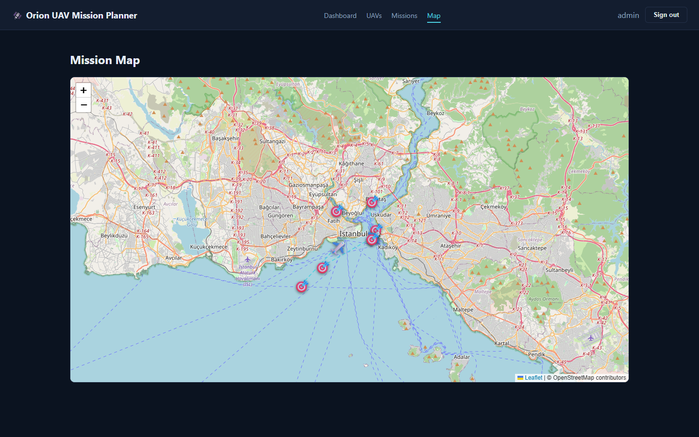
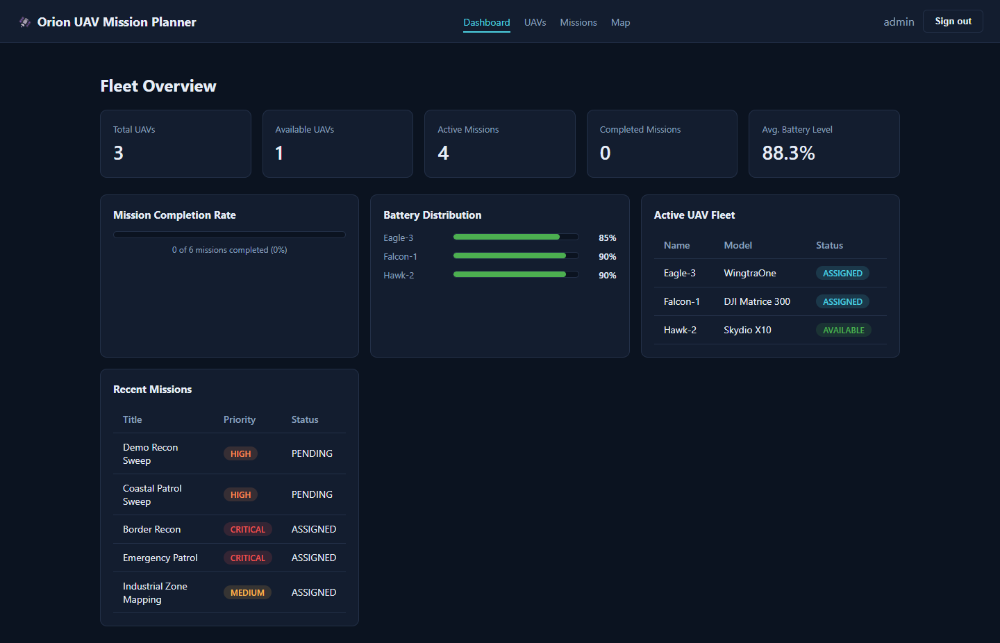
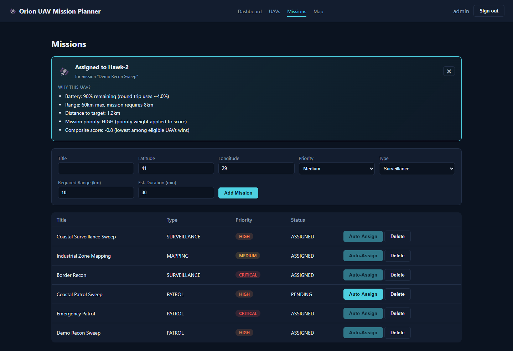
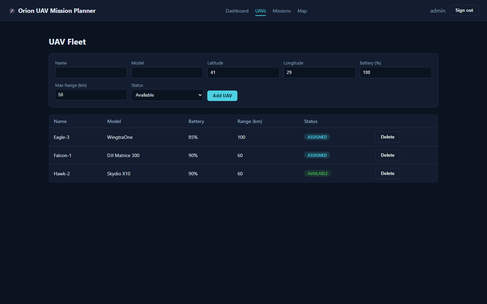
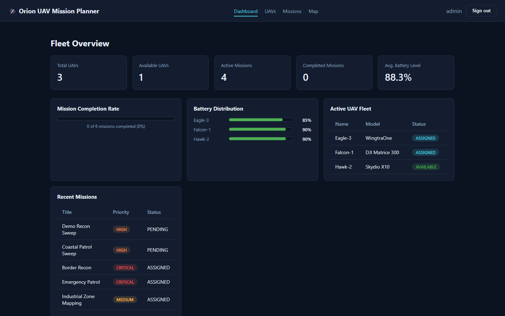

# Orion UAV Mission Planner

A defense-inspired mission planning and UAV fleet management simulation system built with **Spring Boot**, **React**, **PostgreSQL** and **Leaflet**.

> This project is a pure planning / simulation / route-optimization system. There is **no** weapons, targeting, or attack functionality of any kind — it focuses on fleet management, mission scheduling, and battery/range-aware route assignment.


*Live fleet view: drone and target markers with dashed UAV → Mission route lines for active assignments.*

## Screenshots

| Dashboard | Mission Auto-Assignment |
|---|---|
|  |  |

| UAV Fleet | Login |
|---|---|
|  |  |

## Features

- UAV fleet management (CRUD)
- Mission creation and lifecycle tracking
- **Auto mission assignment** — a scoring algorithm picks the best available UAV for a mission, with a plain-English explanation of *why* it won
- Battery-aware, range-aware route planning
- Real-time fleet dashboard: completion rate, battery distribution, active fleet, recent missions
- Map-based visualization with drone/target markers and live UAV → Mission route lines (Leaflet / OpenStreetMap)
- JWT authentication
- REST API documentation with Swagger / OpenAPI
- Unit tests for the assignment algorithm

## Architecture

```
┌──────────────┐        REST/JSON + JWT        ┌───────────────────┐       JDBC      ┌────────────┐
│ React + Vite │  <-------------------------->  │   Spring Boot API  │ <------------>  │ PostgreSQL │
│ (Leaflet UI) │                                 │  (JPA + Security)  │                 │            │
└──────────────┘                                 └───────────────────┘                 └────────────┘
```

## Tech Stack

| Layer      | Technology                                  |
|------------|----------------------------------------------|
| Frontend   | React, Vite, TypeScript, Leaflet (react-leaflet) |
| Backend    | Spring Boot 3 (Web, Data JPA, Security, Validation) |
| Database   | PostgreSQL 16                                |
| Auth       | JWT (jjwt)                                   |
| Docs       | springdoc-openapi (Swagger UI)               |
| Container  | Docker / docker-compose                      |
| Testing    | JUnit 5, Mockito                             |

## Auto-Assignment Algorithm

When a mission is auto-assigned, every `AVAILABLE` UAV is filtered against hard
eligibility constraints, then scored. The UAV with the **lowest** score wins.

```
score = distanceScore + batteryScore + availabilityScore + priorityScore

distanceScore     = great-circle distance (km) from UAV to mission (Haversine formula)
batteryScore      = 100 - batteryLevel                     (fuller battery -> lower score)
availabilityScore = 0 if AVAILABLE, otherwise a large penalty
priorityScore      = negative offset that grows with mission priority
                      (LOW=0, MEDIUM=-5, HIGH=-12, CRITICAL=-25)
```

Hard eligibility filters (applied before scoring — a UAV failing any of these is excluded):
- UAV status must be `AVAILABLE`.
- UAV's max range must cover the mission's required range **and** the round trip distance.
- Remaining battery after the round trip must keep at least a 15% safety reserve.

**Explainability**: every `POST /api/missions/{id}/assign` call returns a `reasons[]`
array spelling out *why* the winning UAV was chosen — battery margin, range vs.
requirement, distance to target, mission priority, and the final composite score
(see the Mission Auto-Assignment screenshot above). This is surfaced directly in
the UI as an "Assignment Explanation" card, not just logged server-side.

This is intentionally a simple, explainable greedy scorer for v1. Planned extensions:
- Dijkstra / A* route planning around no-fly zones
- Multi-UAV mission optimization (assigning several missions at once)
- Battery-aware dynamic re-routing

## Database Schema

```
users          (id, username, password, role)
uavs           (id, name, model, latitude, longitude, batteryLevel, maxRangeKm, status, createdAt)
missions       (id, title, latitude, longitude, priority, type, status, requiredRangeKm, estimatedDurationMinutes, createdAt)
assignments    (id, uavId, missionId, estimatedDistanceKm, estimatedBatteryUsage, assignmentScore, status, assignedAt)
mission_logs   (id, missionId, message, loggedAt)
```

## API Endpoints

| Method | Endpoint                  | Description                          |
|--------|----------------------------|---------------------------------------|
| POST   | `/api/auth/register`       | Create a new operator account         |
| POST   | `/api/auth/login`          | Log in and receive a JWT              |
| GET    | `/api/uavs`                | List all UAVs                         |
| POST   | `/api/uavs`                | Add a new UAV                         |
| GET    | `/api/uavs/{id}`           | Get a single UAV                      |
| PUT    | `/api/uavs/{id}`           | Update a UAV                          |
| DELETE | `/api/uavs/{id}`           | Remove a UAV                          |
| GET    | `/api/missions`            | List all missions                     |
| POST   | `/api/missions`            | Create a new mission                  |
| GET    | `/api/missions/{id}`       | Get a single mission                  |
| PUT    | `/api/missions/{id}`       | Update a mission                      |
| DELETE | `/api/missions/{id}`       | Remove a mission                      |
| POST   | `/api/missions/{id}/assign`| Run auto-assignment for this mission  |
| GET    | `/api/assignments`         | Active UAV↔Mission assignments (map route lines) |
| GET    | `/api/dashboard/stats`     | Aggregated fleet statistics           |

Full interactive docs: `http://localhost:8080/swagger-ui.html`

## ✅ Verified Setup

This project has been built and run end-to-end with `docker compose up --build`
against a real PostgreSQL instance (no mocks). Verified on Windows 11 with
Docker Desktop (WSL2 backend), Docker 29.5.3 / Compose v5.1.4:

- `uav-postgres` container reaches `healthy` status before the backend starts
  (compose `depends_on.condition: service_healthy`).
- `uav-backend` builds via the multi-stage `Dockerfile` (Maven build stage +
  JRE runtime stage) and boots successfully on port `8080`.
- `DataSeeder` populates a demo admin account and sample UAVs/missions on first boot
  (see `DataSeeder.java` for the seeded credentials — intentionally not printed here).
- `POST /api/auth/login` issues a working JWT for the seeded account.
- `POST /api/missions/{id}/assign` was exercised against the live database:
  - Two pending missions were each assigned to the closest eligible `AVAILABLE` UAV
    (UAV status flipped to `ASSIGNED`, mission status flipped to `ASSIGNED`).
  - A third mission created after all UAVs became unavailable correctly returned
    `409 Conflict` with `"No eligible UAV found..."` from the no-eligible-UAV path.
- `GET /api/dashboard/stats` reflected the updated counts after assignment
  (`availableUavs` dropped to 0, `activeMissions` rose to 2).
- The frontend (`npm run dev`) serves correctly on port `5173` and its Vite
  dev-server proxy (`vite.config.ts`) forwards `/api/*` calls to the backend.

To reproduce:
```bash
docker compose up --build
# Log in with the seeded admin account (see DataSeeder.java), then call
# /api/missions/{id}/assign with the returned JWT to see the algorithm in action.
```

## Getting Started

### Option A — Docker Compose (recommended)

```bash
docker compose up --build
```

This starts PostgreSQL + the Spring Boot backend. Then run the frontend separately:

```bash
cd frontend
npm install
npm run dev
```

Open `http://localhost:5173`. A demo admin account and a few sample UAVs/missions
are seeded automatically on first boot — see `DataSeeder.java` for the credentials,
or just click "Register" on the login screen to create your own account.

### Option B — Run locally

**Backend**
```bash
cd backend
# Configure DB_HOST/DB_USER/DB_PASSWORD env vars or edit src/main/resources/application.yml
mvn spring-boot:run
```

**Frontend**
```bash
cd frontend
npm install
npm run dev
```

### Running Tests

```bash
cd backend
mvn test
```

## Roadmap

- [ ] Dijkstra / A* route planning
- [ ] Greedy multi-mission batch assignment
- [ ] Multi-UAV optimization (assignment as a min-cost matching problem)
- [ ] No-fly zone avoidance
- [ ] Battery-aware dynamic re-routing mid-mission

## License

MIT
